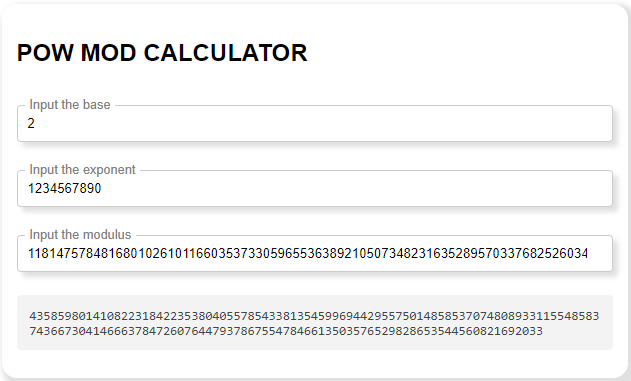
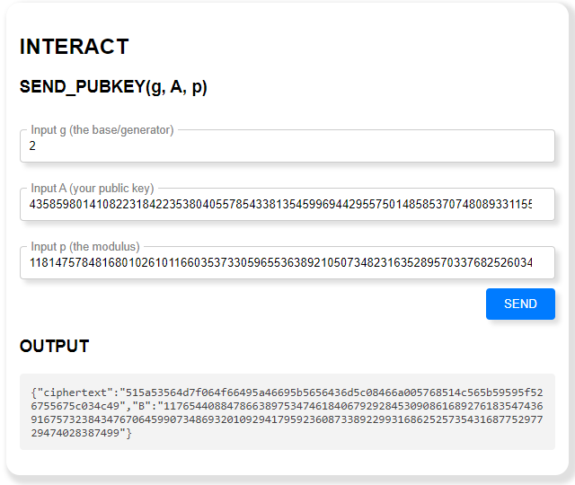
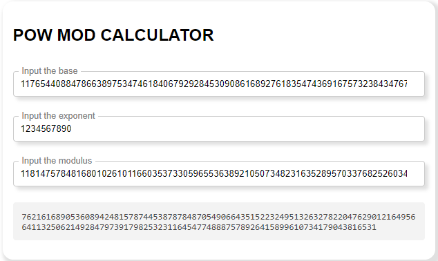
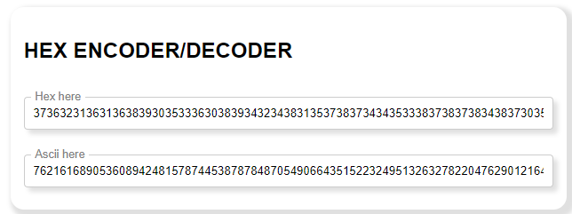
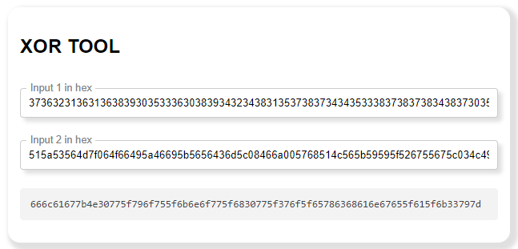

# Internet Festival 2023 - HighSchools CTF Workshop

## ![crypto] Diffie - Hellman Key Exchange (4 risoluzioni)

Questa challenge non presenta vulnerabilià da sfruttare, ma è semplicemente un esempio guidato di uno scambio di chiavi Diffie-Hellman. Serve scegliere il numero `g`, per esempio `2`, la chiave privata `a`, per esempio `1234567890`, e il modulo `p` per esempio quello consigliato nella descrizione della challenge. Si calcola `A` come `g^a mod p` tramite il tool presente sul sito: 

Si mandano al server i valori `g`, `p` ed `A` e questo risponderà con `B` e il testo cifrato: 

Il prossimo step è calcolare la chiave condivisa facendo `B^a mod p`: 

Poi si converte la chiave condivisa (come stringa) in esadecimale: 

Ed infine si decifra il testo cifrato facendo lo xor con la chiave condivisa: 

La flag si ottiene decodificando il valore ottenuto da esadecimale a ascii.
